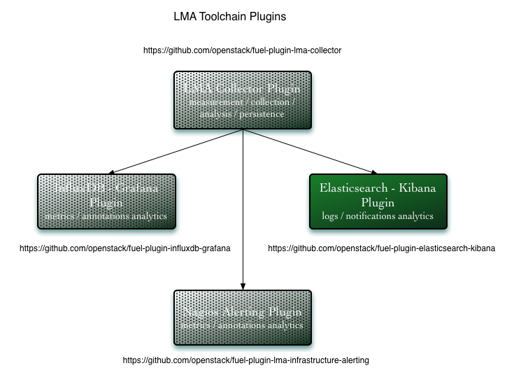

.. _intro:

Introduction
============

The **StackLight Elasticsearch-Kibana plugin** is used to install and configure
Elasticsearch and Kibana components that collectively provide access to the
logs and notifications analytics of the so-called Logging, Monitoring, and
Alerting (LMA) Toolchain of Mirantis OpenStack.

These analytics can be used to search and correlate service-affecting
events which may occur on your OpenStack environment. It is an indispensable
tool to troubleshoot problems.

Elasticsearch and Kibana are key components of the
`LMA Toolchain project <https://launchpad.net/lma-toolchain>`_, also known as
StackLight:

