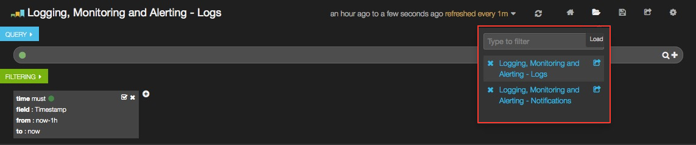
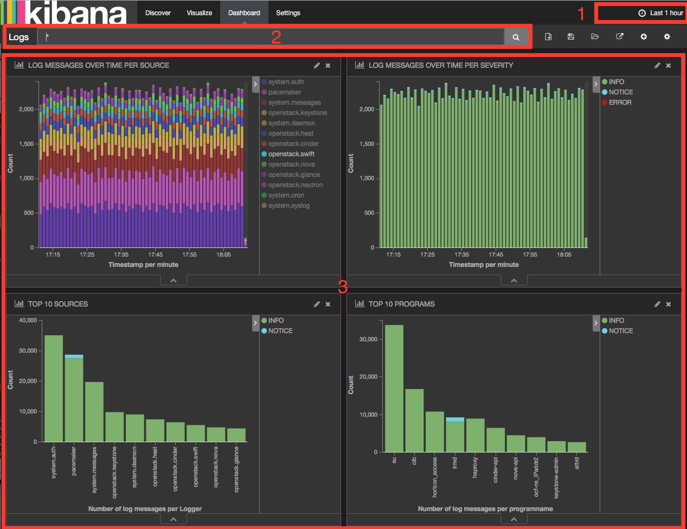
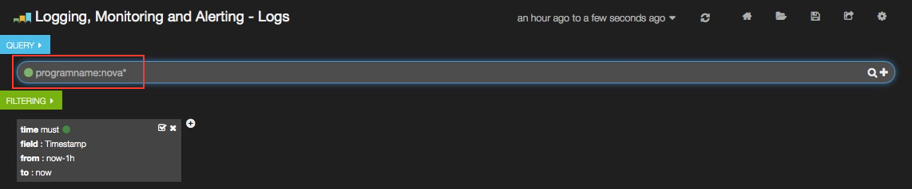

.. _user:

Use the plugin
==============

Dashboards management
---------------------

The StackLight Elasticsearch-Kibana plugin contains two built-in dashboards:

  * The :guilabel:`Logs` Analytics Dashboard that is used to visualize and
    search the logs.
  * The :guilabel:`Notifications` Analytics Dashboard that is used to visualize
    and search the OpenStack notifications if you enabled the feature in the
    Collector settings.

You can switch from one dashboard to another by clicking on the top-right
:guilabel:`Load` icon on the toolbar to select the requested dashboard from
the list, as shown below:

Each dashboard provides a single pane of glass for visualizing and searching
all the logs and the notifications of your OpenStack environment.

In the Collector settings, you can tag the logs by an environment name to
distinguish which logs (and notifications) belong to what environment.

The Kibana Dashboard for logs is divided into several sections.

1. A time-picker control that lets you choose the time period you want
   to select and refresh frequency.

2. A text box to enter search queries.

3. Various logs analytics with six different panels:

   a. A stack graph showing all the logs per source.
   b. A stack graph showing all the logs per severity.
   c. A stack graph showing all logs for top 10 sources.
   d. A stack graph showing all the logs for top 10 programs.
   e. A stack graph showing all logs for top 10 hosts.
   f. A graph showing the number of logs per severity.
   g. A graph showing the number of logs per role.

4. A table of log messages sorted in reverse chronological order.

  .. image:: ../images/kibana_logs_sections_2.png
     :align: center
     :width: 800

Filters and queries
-------------------

Filters and queries have similar syntax but they are used for different
purposes:

* The filters are used to restrict what is displayed in the Dashboard.
* The queries are used for free-text search.

You can combine multiple queries and compare their results.
You can also further filter the log messages. For example, to select
:guilabel:`deployment_id`:

#. Expand a log entry.
#. Select the :guilabel:`deployment_id` field by clicking on the magnifying
   glass icon as shown below:

   .. image:: ../images/kibana_logs_filter1.png
      :align: center
      :width: 800

   This will apply a new filter in the Dashboard:

   .. image:: ../images/kibana_logs_filter2.png
      :align: center
      :width: 800

Filtering works for any field that has been indexed for the log entries that
are in the Dashboard.

Filters and queries can also use wildcards that can be combined with the
*field names* like in ``programname: <name>*``.

For example, to display only the Nova logs, enter ``programname:nova*`` in
the query text box as shown below:

.. raw:: latex

   \pagebreak