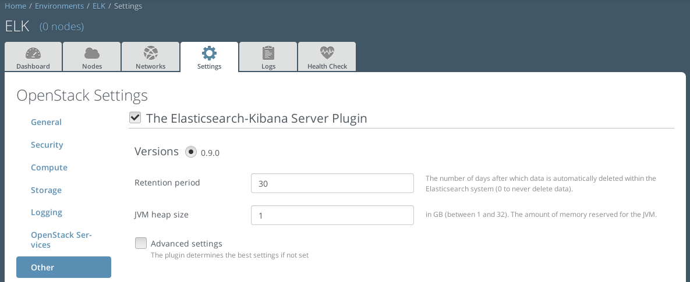
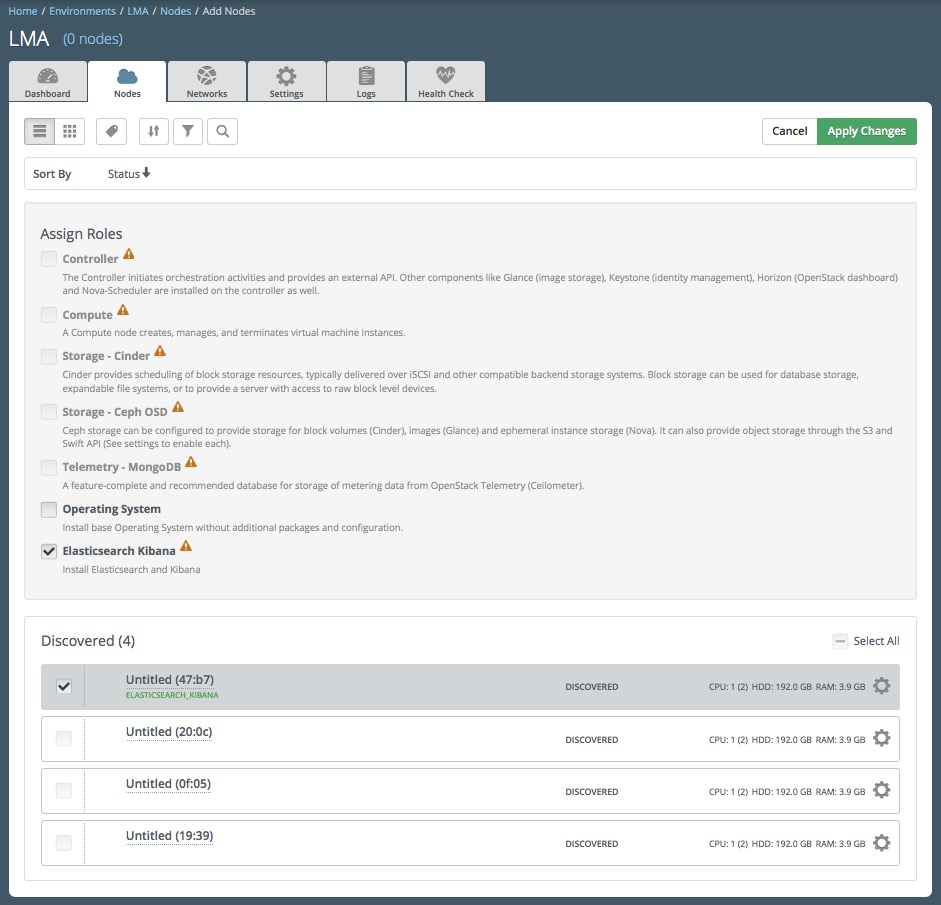

.. _user_guide:

User Guide
==========

.. _plugin_configuration:

Plugin configuration
--------------------

To configure your plugin, you need to follow these steps:

1. `Create a new environment <http://docs.mirantis.com/openstack/fuel/fuel-7.0/user-guide.html#launch-wizard-to-create-new-environment>`_
   with the Fuel web user interface.

2. Click on the Settings tab of the Fuel web UI.

3. Scroll down the page and select the Elasticsearch-Kibana Plugin in the left column.
   The Elasticsearch-Kibana Plugin settings screen should appear as shown below.

4. Select the Elasticsearch-Kibana Plugin checkbox and fill-in the required fields.

  a. Specify the data retention period in number of days.
  b. Specify the JVM heap size for Elastisearch. See configuration recommendations below.

  **Heap sizing**

  By default, 1 GB of heap memory is allocated to the Elasticsearch process.
  This value is too small to run Elasticsearch for anything else than local testing.
  To run Elasticsearch in production you need to allocate at least 4 GB of memory
  but it is recommended to allocate 50% of the available memory up to 32 GB maximum.
  If you set a value that is greater than the memory size, Elasticsearch won't start.

5. `Configure your environment <http://docs.mirantis.com/openstack/fuel/fuel-7.0/user-guide.html#configure-your-environment>`_
   as needed.

6. Assign the *Elasticsearch Kibana* role to a node as shown in the figure below.

  **Disks partitioning**

  By default, the Elasticsearch-Kibana Plugin allocates:

  - 20% of the first available disk for the operating system by honoring a range of 15GB minimum and 50GB maximum.
  - 10GB for */var/log*.
  - At least 30 GB for the Elasticsearch database in */opt/es-data*.

  Please check the `Fuel User Guide <http://docs.mirantis.com/openstack/fuel/fuel-7.0/user-guide.html#assign-a-role-or-roles-to-each-node-server>`_
  if you would like to change the default configuration of the disks partitioning.

7. `Verify the networks <http://docs.mirantis.com/openstack/fuel/fuel-7.0/user-guide.html#verify-networks>`_ on the Networks tab of the Fuel web UI.

8. `Deploy <http://docs.mirantis.com/openstack/fuel/fuel-7.0/user-guide.html#deploy-changes>`_ your changes.

.. _plugin_install_verification:

Plugin verification
-------------------

Be aware, that depending on the number of nodes and deployment setup,
deploying a Mirantis OpenStack environment can typically take anything
from 30 minutes to several hours. But once your deployment is complete,
you should see a notification that looks the following:

.. image:: ../images/deploy_notif.png
   :align: center
   :width: 800

**Elasticsearch**

Once your deployment has completed, you should verify that Elasticsearch is
installed properly using `curl`::

    curl http://$HOST:9200/

Where *HOST* is the IP address of the node which runs the Elasticsearch server.

The expected output should look like something like this::

    {
      "status" : 200,
      "name" : "node-23-es-01",
      "cluster_name" : "elasticsearch",
      "version" : {
          "number" : "1.4.5",
          "build_hash" : "c88f77ffc81301dfa9dfd81ca2232f09588bd512",
          "build_timestamp" : "2015-04-19T13:05:36Z",
          "build_snapshot" : false,
          "lucene_version" : "4.10.4"
      },
      "tagline" : "You Know, for Search"
    }

**Note:** You can retrieve the IP address where Elasticsearch-Kibana is installed using
the `fuel` command line::

    [root@fuel ~]# fuel nodes
    id | status   | name             | cluster | ip        | mac               | roles                | pending_roles | online | group_id
    ---|----------|------------------|---------|-----------|-------------------|----------------------|---------------|--------|---------
    14 | ready    | Untitled (20:0c) | 8       | 10.20.0.8 | 08:00:27:29:20:0c | controller           |               | True   | 8
    13 | ready    | Untitled (47:b7) | 8       | 10.20.0.4 | 08:00:27:54:47:b7 | elasticsearch_kibana |               | True   | 8

**Kibana**

Kibana is installed with two dashboards. One for the logs and one for the
OpenStack notifications.

Each dashboard provides a single pane of glass and search capabilities
for all the logs and all the notifications. Note that in the LMA Collector
settings, it is possible to tag the logs by environment name
so that you can distiguish which logs (and notifications) where created
by environment name.

As for Elasticsearch, you should verify that Kibana is properly
installed through checking its URL::

    http://$HOST:80/

Where *HOST* is the IP address of the node where Kibana has been installed.
By default, you will be redirected to the *Logs Dashboard*.

Dashboards management
---------------------

The Elasticsearch-Kibana plugin comes with two pre-configured dashboards:

  - The *Logs Dashboard* that is the Kibana Home Dashboard for viewing the log messages.
  - The *Notifications Dashboard* for viewing the OpenStack notifications if you enabled
    this option in the LMA Collector settings.

You can switch from one dashboard to another by clicking on the top-right *Load*
icon in the toolbar to select the requested dashboard from the list, as shown below.

.. image:: ../images/kibana_dash.png
   :align: center
   :width: 800

Pointing your browser to the URL *http://10.20.0.4:80/* you should see the Logs Dashboard:

.. image:: ../images/kibana_logs_dash.png
   :align: center
   :width: 800

As you can see, the Kibana dashboard for logs is divided into four main sections:

1. A time-picker control that lets you choose the time period you want
   to select and refresh frequency.

2. A query and filter section where all the filters are displayed.

3. A log analytics row which contains four panels to visualize:

  a. The number of log messages for the chosen time period.

  b. The top 10 hosts filter.

  c. The top 10 log sources.

  d. The number of log messages grouped by severity.

4. A table of log messages sorted in reverse chronological order.

Filters and queries
-------------------

Filters and queries have similar syntax but they are used for different purposes.

  - The filters are used to restrict what is displayed in the dashboard.
  - The queries are used for free-text search.

You can also combine multiple queries and compare their results.
To further filter the log messages based, for example, on the deployment_id,
you need to expand a log entry and then select the deployment_id field by clicking
on the magnifying glass icon as shown below.

.. image:: ../images/kibana_logs_filter1.png
   :align: center
   :width: 800

This will apply a new filter in the dashboard.

.. image:: ../images/kibana_logs_filter2.png
   :align: center
   :width: 800

Filtering will work for any field that has been indexed for the log entries that
are displayed in the dashboard.

Filters and queries can also use wildcards wich can be conbined with *field names* like in::

    programname: <name>*

For example, to display only the Nova logs you could enter::

    programname:nova*

in the query textbox like shown below.

.. image:: ../images/kibana_logs_query1.png
   :align: center
   :width: 800

You can also specify multiple queries to compare different data sets.

To add a new query, click on the **+** sign at the right-end of the query
textbox and enter a new search query.

The resulting filtering should appear comparing those logs that are
in *ERROR* versus those that are not as shown below.

.. image:: ../images/kibana_logs_query2.png
   :align: center
   :width: 800

Troubleshooting
---------------

If you get no data in the Kibana dashboards, follow these troubleshoot tips.

1. First, check that the LMA Collector is running properly by following the
   troubleshooting instructions of the
   `LMA Collector Fuel Plugin User Guide <http://fuel-plugin-lma-collector.readthedocs.org/en/latest/user/guide.html/>`_.

2. Check if the nodes are able to connect to the Elasticsearch server on port *9200*.

3. Check that the Elasticsearch server is up and running::

    # On both CentOS and Ubuntu
    [root@node-13 ~]# /etc/init.d/elasticsearch-es-01 status

4. If Elasticsearch is down, start it::

    # On both CentOS and Ubuntu
    [root@node-13 ~]# /etc/init.d/elasticsearch-es-01 start

5. Check if nginx is up and running::

    # On both CentOS and Ubuntu
    [root@node-13 ~]# /etc/init.d/nginx status

6. If nginx is down, start it::

    # On both CentOS and Ubuntu
    [root@node-13 ~]# /etc/init.d/nginx start
