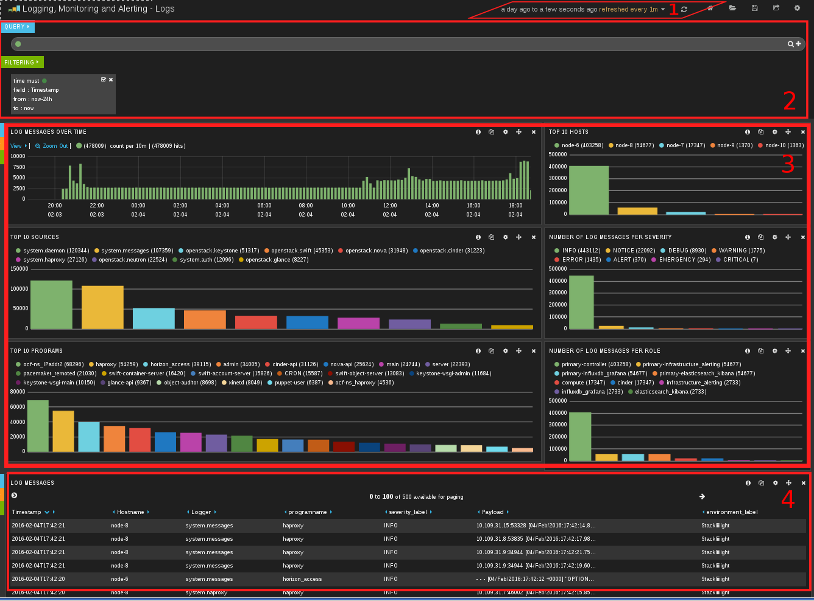
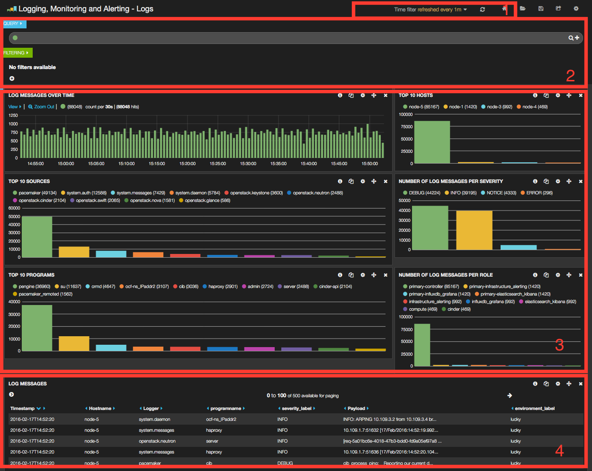
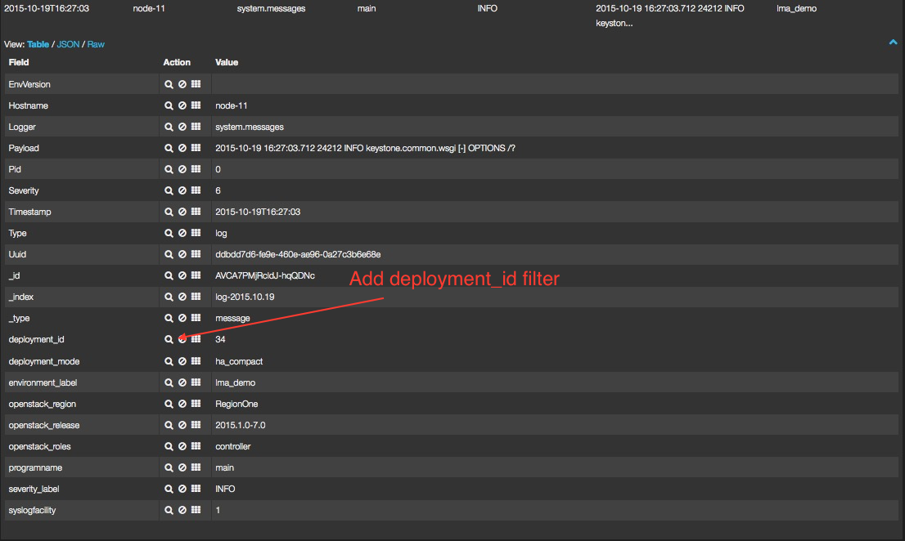
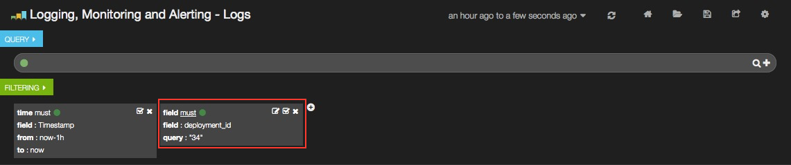
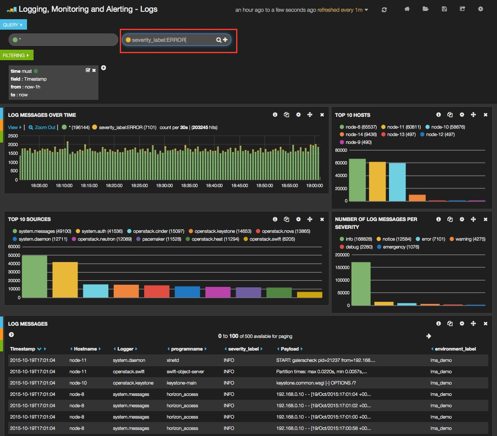

.. _user_guide:

User Guide
==========

.. _plugin_configuration:

Plugin configuration
--------------------

To configure your plugin, you need to follow these steps:

1. `Create a new environment <http://docs.mirantis.com/openstack/fuel/fuel-8.0/user-guide.html#launch-wizard-to-create-new-environment>`_
   from the Fuel web user interface.

#. Click the **Settings** tab and select the **Other** category.

#. Scroll down through the settings until you find the **Elasticsearch-Kibana Server
   Plugin** section. You should see a page like this.

   .. image:: ../images/elastic_kibana_settings.png
      :width: 800
      :align: center

#. Check the *Elasticsearch-Kibana Server Plugin* box and fill-in the required fields
   as indicated below.

   a. Specify the number of days of retention for your data.
   b. Specify the JVM heap size for Elastisearch. See configuration recommendations below.

   .. note:: By default, 1GB of heap memory is allocated to the Elasticsearch process.
      This value is too small to run Elasticsearch for anything else than local testing.
      To run Elasticsearch in production you need to allocate at least 4 GB of memory
      but it is recommended to allocate 50% of the available memory up to 32 GB maximum.
      If you set a value that is greater than the memory size, Elasticsearch won't start.
      Keep in mind also to reserve enough memory for the operating system and the other services.

   At this point, you can choose to edit advanced settings or let the plugin
   apply sane defaults for you. The advanced settings are used to specify the clustering
   parameters when the *Elasticsearch-Kibana Server Plugin* is installed on more than one node.
   To manually configure those advanced settings, check the *Advanced settings* box and fill-in
   the required parameters.

#. When you are done with the settings, scroll down to the bottom of the page and click
   the **Save Settings** button.

#. Click the *Nodes* tab and assign the *Elasticsearch_Kibana* role to nodes as shown
   in the figure below. You can see in this example that the *Elasticsearch_Kibana* role
   is assigned to three different nodes along with the *Infrastructure_Alerting* role
   and the *InfluxDB_Grafana* role. This means that the three plugins of the LMA toolchain
   can be installed on the same nodes.
   
   .. image:: ../images/elastic_kibana_role.png
      :width: 800
      :align: center

   .. note:: You can assign the *Elasticsearch_Kibana* role up to five nodes.
      The Elasticsearch clustering for high availability requires that you assign
      the *Elasticsearch_Kibana* role to at least three nodes. Note also that
      is possible to add or remove a node with the *Elasticsearch_Kibana* role after deployment.

#. Click on **Apply Changes**

#. Adjust the disk configuration if necessary (see the `Fuel User Guide
   <http://docs.mirantis.com/openstack/fuel/fuel-8.0/user-guide.html#disk-partitioning>`_
   for details). By default, the Elasticsearch-Kibana Plugin allocates:

   - 20% of the first available disk for the operating system by honoring a range of 15GB minimum and 50GB maximum.
   - 10GB for */var/log*.
   - At least 30 GB for the Elasticsearch database in */opt/es-data*.

#. `Configure your environment <http://docs.mirantis.com/openstack/fuel/fuel-8.0/user-guide.html#configure-your-environment>`_
   as needed.

#. `Verify the networks <http://docs.mirantis.com/openstack/fuel/fuel-8.0/user-guide.html#verify-networks>`_ on the Networks tab of the Fuel web UI.

#. And finally, `Deploy <http://docs.mirantis.com/openstack/fuel/fuel-8.0/user-guide.html#deploy-changes>`_ your changes.

.. _plugin_install_verification:

Plugin verification
-------------------

Be aware, that depending on the number of nodes and deployment setup,
deploying a Mirantis OpenStack environment can typically take anything
from 30 minutes to several hours. But once your deployment is complete,
you should see a deployment success notification message with
a link to the Kibana dashboard as shown in the figure below:

.. image:: ../images/deploy_notif.png
   :align: center
   :width: 800

.. note:: Be aware that Kibana is attached to the *management network*. 
   Your desktop machine must have access to the OpenStack environment's
   *management network* you just created, to get access to the Kibana dashboard

Verifying Elasticsearch
~~~~~~~~~~~~~~~~~~~~~~~

You should verify that the Elasticsearch cluster is running properly.
To do that, you need first to retrieve the Elasticsearch cluster VIP address.
Here is how to proceed.

#. On the Fuel Master node, find the IP address of a node where the Elasticsearch
   server is installed using the following command::

    [root@fuel ~]# fuel nodes
    id | status   | name             | cluster | ip  | mac | roles                |
    ---|----------|------------------|---------|-----|----------------------------|
    1  | ready    | Untitled (fa:87) | 1       | ... | ... | elasticsearch_kibana |
    2  | ready    | Untitled (12:aa) | 1       | ... | ... | elasticsearch_kibana |
    3  | ready    | Untitled (4e:6e) | 1       | ... | ... | elasticsearch_kibana |

#. Then `ssh` to anyone of these nodes (ex. *node-1*) and type the command::

    root@node-1:~# hiera lma::elasticsearch::vip
    10.109.1.5

   This tells you that the VIP address of your Elasticsearch cluster is *10.109.1.5*.

#. With that VIP address type the command::

     curl http://10.109.1.5:9200/

   The output should look like this::

    {
      "status" : 200,
      "name" : "node-3.test.domain.local_es-01",
      "cluster_name" : "lma",
      "version" : {
        "number" : "1.7.4",
        "build_hash" : "0d3159b9fc8bc8e367c5c40c09c2a57c0032b32e",
        "build_timestamp" : "2015-12-15T11:25:18Z",
        "build_snapshot" : false,
        "lucene_version" : "4.10.4"
      },
      "tagline" : "You Know, for Search"
    }

Verifying Kibana
~~~~~~~~~~~~~~~~

From the Fuel web UI **Dashboard** view, click on the **Kibana** link,
you should be directed to the *Logs Dashboard* as shown in the figure below.

Dashboards management
---------------------

The *Elasticsearch-Kibana Server Plugin* comes with two predefined dashboards:

  - The *Logs Dashboard* which is the Kibana Home Dashboard for viewing the log messages.
  - The *Notifications Dashboard* for viewing the OpenStack notifications if you enabled
    this option in the LMA Collector settings.

You can switch from one dashboard to another by clicking on the top-right *Load*
icon in the toolbar to select the requested dashboard from the list, as shown below.

.. image:: ../images/kibana_dash.png
   :align: center
   :width: 800

Each dashboard provides a single pane of glass for visualizing and searching
all the logs and notifications of your OpenStack environment.
Note that in the LMA Collector settings, it is possible to tag the logs by
environment name so that you can distinguish which logs (and notifications)
belong to which environment.

As you can see, the Kibana dashboard for logs is divided into four main sections:

1. A time-picker control that lets you choose the time period you want
   to select and refresh frequency.

2. A query and filter section where all the filters are displayed.

3. A log analytics row which contains six panels to visualize:

  a. The number of log messages for the chosen time period.

  b. The top 10 hosts filter.

  c. The top 10 log sources.

  d. The number of log messages grouped by severity.

  e. The top 10 programs.

  f. The number of log messages grouped by role.

4. A table of log messages sorted in reverse chronological order.

Filters and queries
-------------------

Filters and queries have similar syntax but they are used for different purposes.

  - The filters are used to restrict what is displayed in the dashboard.
  - The queries are used for free-text search.

You can also combine multiple queries and compare their results.
To further filter the log messages to, for example, select the *deployment_id*,
you need to expand a log entry and then select the *deployment_id* field
by clicking on the magnifying glass icon as shown below.

This will apply a new filter in the dashboard.

Filtering will work for any field that has been indexed for the log entries that
are in the dashboard.

Filters and queries can also use wildcards which can be combined with *field names* like in::

    programname: <name>*

For example, to display only the Nova logs you could enter::

    programname:nova*

in the query textbox as shown below.

.. image:: ../images/kibana_logs_query1.png
   :align: center
   :width: 800

You can also specify multiple queries to compare different data sets.

To add a new query, click on the **+** sign at the right-end of the query
textbox and enter a new search query.

The resulting filtering should appear comparing those logs that are
in *ERROR* versus those that are not as shown below.

Troubleshooting
---------------

If you cannot access the Kibana dashboard or you get no data in the dashboard,
follow these troubleshooting tips.

1. First, check that the LMA Collector is running properly by following the
   LMA Collector troubleshooting instructions in the
   `LMA Collector Fuel Plugin User Guide <http://fuel-plugin-lma-collector.readthedocs.org/>`_.

#. Check that the nodes are able to connect to the Elasticsearch cluster via the VIP address
   on port *9200* as explained in the `Verifying Elasticsearch` section above.

#. On anyone of the *Elasticsearch_Kibana* role nodes, check the status of the VIP address
   and HAProxy resources in the Pacemaker cluster::

     root@node-1:~# crm resource status vip__es_vip_mgmt
     resource vip__es_vip_mgmt is running on: node-1.test.domain.local

     root@node-1:~# crm resource status p_haproxy
     resource p_haproxy is running on: node-1.test.domain.local

#. If the VIP or HAProxy resources are down, restart them::

     root@node-1:~# crm resource start vip__es_vip_mgmt
     root@node-1:~# crm resource start p_haproxy

#. Check that the Elasticsearch server is up and running::

     # On both CentOS and Ubuntu
     [root@node-1 ~]# /etc/init.d/elasticsearch-es-01 status

#. If Elasticsearch is down, restart it::

     # On both CentOS and Ubuntu
     [root@node-1 ~]# /etc/init.d/elasticsearch-es-01 start

#. Check if nginx is up and running::

    # On both CentOS and Ubuntu
    [root@node-1 ~]# /etc/init.d/nginx status

#. If nginx is down, restart it::

    # On both CentOS and Ubuntu
    [root@node-1 ~]# /etc/init.d/nginx start

#. Look for errors in the Elasticsearch log files (located at /var/log/elasticsearch/es-01/).

#. Look for errors in the nginx log files (located at /var/log/nginx/).
