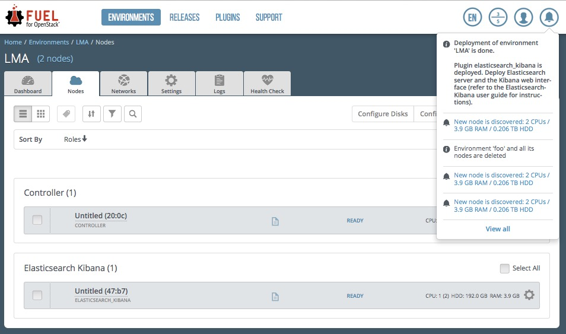

.. _verification:

Verify the plugin after deployment
==================================

Depending on the number of nodes and deployment setup, deploying a
Mirantis OpenStack environment can typically take from 20 minutes
to several hours. But once your deployment is complete, you should see a
deployment success notification message with two links to Kibana as shown
in the picture below:

.. note::
   Two different ports are created to enforce the access authorization
   to Kibana:

    * One port (80) for users with the *admin role*
    * One port (81) for users with the *viewer role*.

   If Kibana is installed on the *management network*, you may not have
   direct access to the Kibana web UI. Some extra network configuration may
   be required to create an SSH tunnel to the *management network*.

.. _verify-elastic:

Verifying Elasticsearch
-----------------------

To verify that the Elasticsearch cluster is running properly, first retrieve
the Elasticsearch cluster virtual IP address:

#. On the Fuel Master node, find the IP address of a node where the
   Elasticsearch server is installed using the :command:`fuel nodes` command:

   .. code-block:: console

    [root@fuel ~]# fuel nodes
    id|status|name            |cluster|ip  |mac |roles               |
    --|------|----------------|-------|----|-------------------------|
    1 |ready |Untitled (fa:87)| 1     |... |... |elasticsearch_kibana|
    2 |ready |Untitled (12:aa)| 1     |... |... |elasticsearch_kibana|
    3 |ready |Untitled (4e:6e)| 1     |... |... |elasticsearch_kibana|

#. Log in to any of these nodes using SSH, for example, to ``node-1``.
#. Run the following command:

   .. code-block:: console

    root@node-1:~# hiera lma::elasticsearch::vip
    10.109.1.5

   Where ``10.109.1.5`` is the virtual IP address of your Elasticsearch cluster.

#. With that virtual IP address, run the following command:

   .. code-block:: console

     curl http://10.109.1.5:9200/

   The output should look as follows:

   .. code-block:: console

    {
      "status" : 200,
      "name" : "node-3.test.domain.local_es-01",
      "cluster_name" : "lma",
      "version" : {
        "number" : "1.7.4",
        "build_hash" : "0d3159b9fc8bc8e367c5c40c09c2a57c0032b32e",
        "build_timestamp" : "2015-12-15T11:25:18Z",
        "build_snapshot" : false,
        "lucene_version" : "4.10.4"
      },
      "tagline" : "You Know, for Search"
    }

.. raw:: latex

   \pagebreak

Verifying Kibana
----------------

To verify the Kibana Dashboard:

#. Log in to the Fuel web UI.
#. Click on the :guilabel:`Kibana (Admin role)` link.
   If your DNS is not setup, enter the IP address and the port number.
#. Enter your credentials.

   You should be redirected to the Kibana **Logs Anaytics Dashboard** with four
   logs' sections as follows:

   .. image:: ../images/kibana_logs_dash.png
      :align: center
      :width: 800
